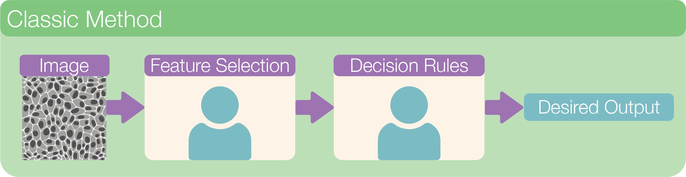

# Classical Methods

**Classical methods** in segmentation processing generally refers to using intensity thresholding to segmenting image. However, another important aspect that distinguishes classical methods from machine learning and deep learning approaches is the level of human input in the process. Classical methods have the **highest** amount of human input.

    

## Lesson Overview

The following lesson is in two acts, each introduced by a lecture component:

* Act 1: Learn how to write Python code to conduct classical segmentation processing on a single image
* Act 2: Learn how to adapt the code to process many images

In **Act 1**, we will walk through the following classical processing steps:

1. Setup
2. Loading an Image
3. Filtering
4. Thresholding
5. Labeling
6. Mask Refinement

In **Act 2**, we will finish the lesson with the following section:

1. Processing Many Images

## Dataset

<a href="https://drive.google.com/uc?export=download&id=1Svlnr2R5CYf5NvRzx3FxghrrxdfnPdiY">
  <i class="fas fa-download"></i> DAPI dataset
</a> containing images of DAPI-stained nuclei.

Let's get ready to code!
