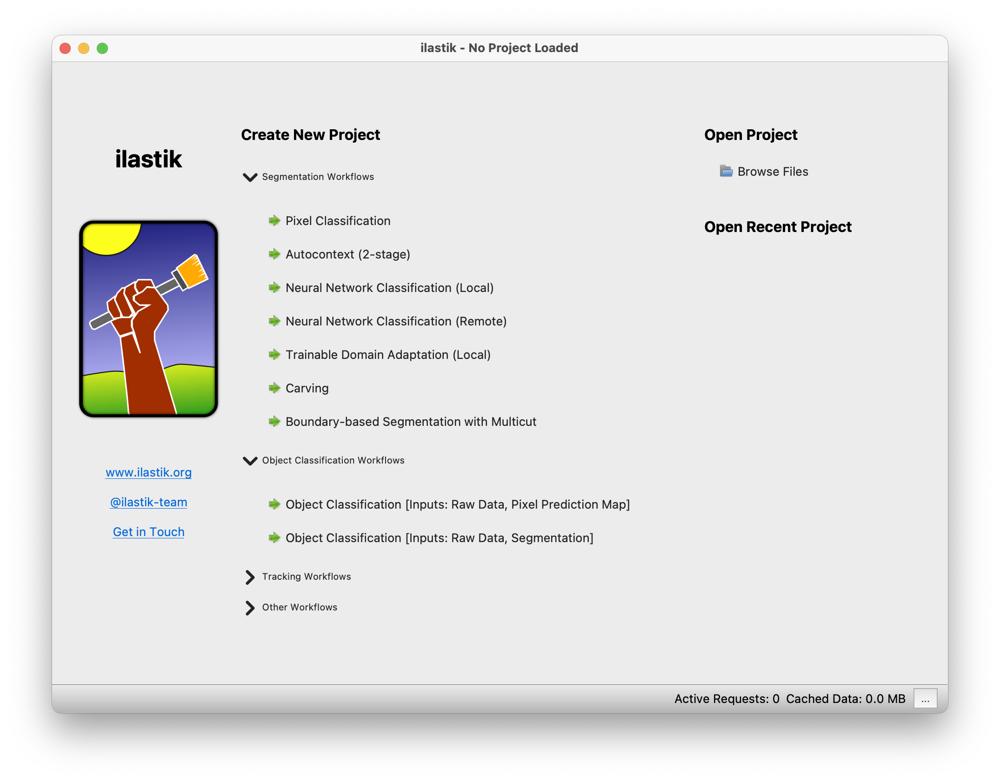

# Introduction to Ilastik

[**Ilastik**](https://www.ilastik.org) is a **free**, **open-source** software tool designed for **interactive image analysis**, including tasks such as **segmentation** and **classification** on multi-dimensional datasets (e.g. 2D, 3D), without requiring prior expertise in machine learning or programming.

    

At its core, **Ilastik** employs supervised machine learning techniques. **Users annotate images by labeling regions of interest**, and the software **trains a classifier** (typically a [Random Forest algorithm](https://en.wikipedia.org/wiki/Random_forest)) **to recognize patterns and distinguish between different classes within the images**.

The software is well-documented, with comprehensive resources available [here](https://www.ilastik.org/documentation/).

## Download and Install Ilastik

**Ilastik** as available as an application with a **graphical user interface (GUI)**. The latest version can be downloaded [here](https://www.ilastik.org/download). Select the appropriate version depending on the operating system (e.g. Windows, macOS). The installation process is straightforward and typically involves running an installer or dragging the application to the Applications folder (on macOS).

## What's Next?

In the following two sections, we will first use **Ilastik** to perform [**semantic segmentation using pixel classification**](./pixel_classification_with_ilastik.md), and then demonstrate how to convert these results into [**instance segmentation**](./from_ilastik_masks_to_labels.ipynb).
