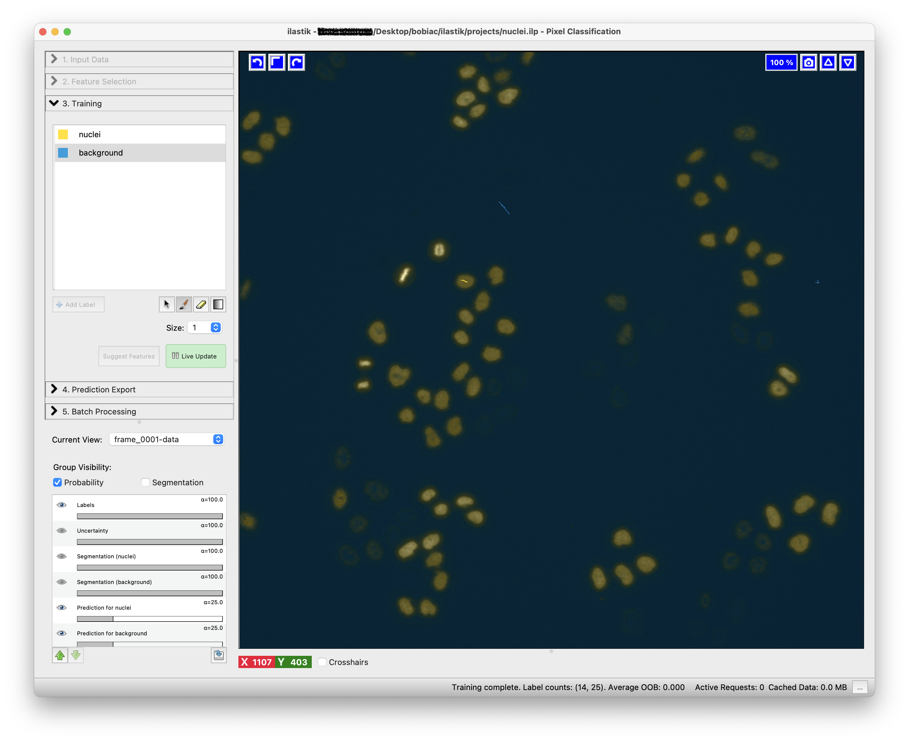
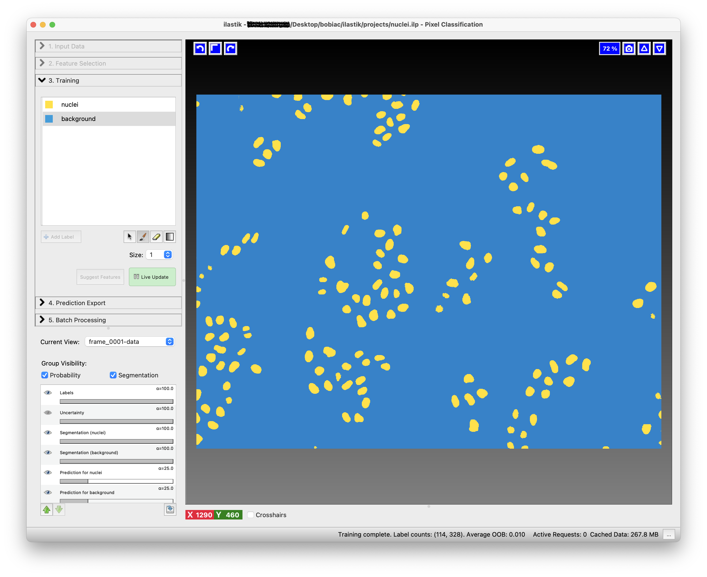
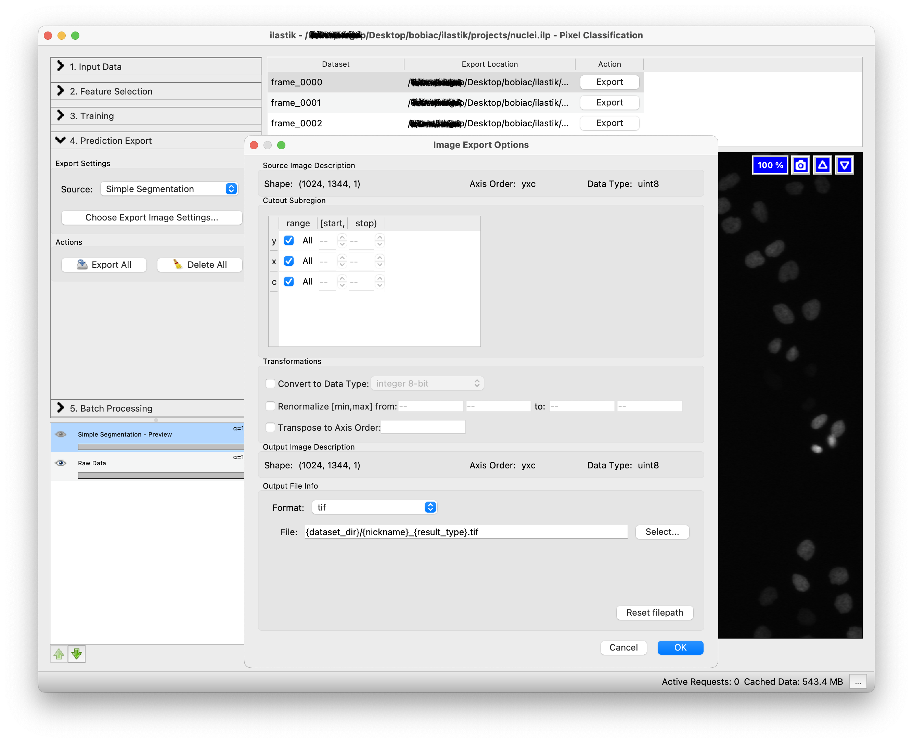
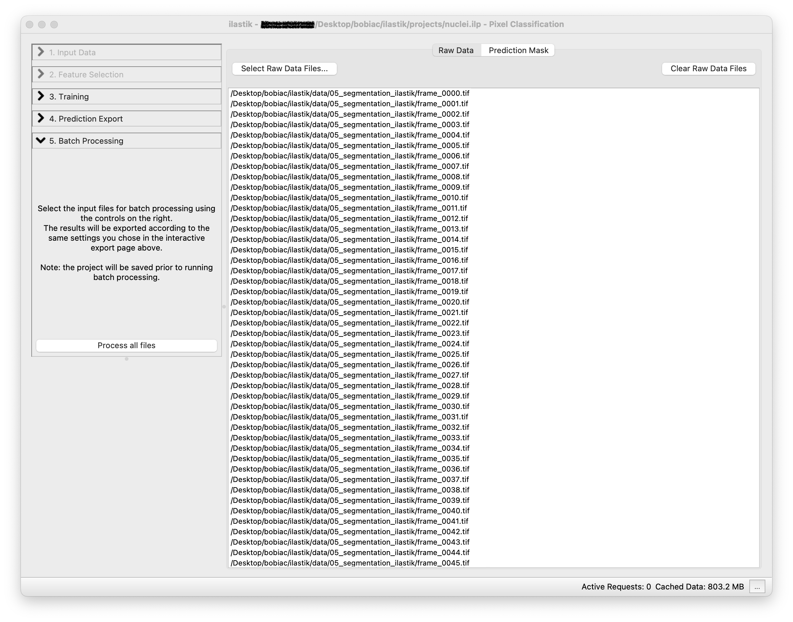

# Ilastik for Pixel Classification

In this section, we will explore how to use **Ilastik** for **semantic segmentation** through [**pixel classification**](https://www.ilastik.org/documentation/pixelclassification/pixelclassification). This process involves training a machine learning model to classify pixels in an image based on user-defined labels.

In this exercise, we will use the <a href="../../../_static/data/05_segmentation_ilastik.zip" download> <i class="fas fa-download"></i> pixel classification dataset</a> of nuclei images, and the goal is to train a classifier to distinguish between **nuclei** and **background**.

    <strong>NOTE:</strong> Ilastik supports a variety of <a href="https://www.ilastik.org/documentation/basics/dataselection#formats" target="_blank">data formats</a>. For simplicity and ease of use during this course, we will use images saved as <strong>.tif</strong> files. However, Ilastik recommends using files saved as <strong>.h5</strong> for [optimal performance](https://www.ilastik.org/documentation/basics/performance_tips). If you wish to use your own dataset and need to convert your files to <strong>.h5</strong>, Ilastik provides tools such as a <a href="https://www.ilastik.org/documentation/fiji_export/plugin" target="_blank">Fiji plugin</a> or a <a href="https://github.com/ilastik/ilastik/tree/main/notebooks/h5convert" target="_blank">Jupyter Notebook</a> with instructions.

## What is Pixel Classification?

**Pixel classification** is a fundamental image analysis technique that involves **assigning a specific category or class to each pixel** in an image based on its unique features, such as color, intensity, or texture. This approach is particularly valuable in tasks like **semantic segmentation**, where the objective is to **divide an image into meaningful regions** by categorizing pixels into predefined classes, such as background, foreground, or distinct objects.

## Ilastik Pixel Classification Workflow

For a detailed workflow instruction, you can refer to the [Ilastik Pixel Classification Documentation](https://www.ilastik.org/documentation/pixelclassification/pixelclassification).

### 1. Select the Workflow

When you open **Ilastik**, you will see the [Startup Screen](https://www.ilastik.org/documentation/basics/startup) with various workflows. Select the ***Pixel Classification*** workflow by clicking on it. You will be automatically brought to the **Input Data** step.

  

    <strong>NOTE:</strong> Remember to save your project regularly using <strong>Cmd+S</strong> (macOS) or <strong>Ctrl+S</strong> (Windows), or via <strong>Project → Save Project</strong>.

### 2. Load the Image Data

Next, you will need to [load the image data](https://www.ilastik.org/documentation/basics/dataselection) you want to use to train the classifier. Select the ***Raw Data*** tab and either *Drag and drop* your image files into the ***Add New...*** field of the data table or click on it to select your images. To create a robust classifier, you should load multiple images from the dataset. For this exercise, you can load 3 random images from the <a href="../../../_static/data/05_segmentation_ilastik.zip" download> <i class="fas fa-download"></i> pixel classification dataset</a>.

  

Once loaded, you can view the images by clicking on the image name in the data table. The corresponding image will be displayed in the window viewer.

  

### 3. Select the Features

To continue, click on the ***Feature Selection*** step (on the left side of the GUI) and then on the ***Select Features...*** button. Here, you can select the [features](https://www.ilastik.org/documentation/pixelclassification/pixelclassification#selecting-good-features) and their scales (how much) that will be used to discriminate between the different classes of pixels.

For pixel classification, **Ilastik** provides a list of features types, divided by ***Color/Intensity***, ***Edge***, and ***Texture***:

- ***Color/Intensity***: these features should be selected if the color or brightness can be used to discern objects
- ***Edge***: should be selected if brightness or color gradients can be used to discern objects.
- ***Texture***: this might be an important feature if the objects in the image have a special textural appearance.

  

 

For each of the feature you can also choose the ***scale***. The scales correspond to the *sigma of the Gaussian* which is used to smooth the image before application of the filter. Filters with larger sigmas can thus pull in information from larger neighborhoods, but average out the fine details.

  

 

After clicking on ***Ok***, you can **visualize the effect of the selected features** by clicking on one of the options in the **Features** list in the bottom left part of the GUI. This will help you understand if the selected features are suitable for your dataset. You can always go back to the ***Feature Selection*** step to change the features and their scales.

    <strong>NOTE:</strong> In the next step, you will be able to also use the <a href="https://www.ilastik.org/documentation/pixelclassification/pixelclassification#suggest" target="_blank"><strong><i>Suggest Features</i></strong></a> functionality that could help you to select the most suitable features for your dataset.

  

### 4. Train the Classifier

The next step is to <a href="https://www.ilastik.org/documentation/pixelclassification/pixelclassification#training-the-classifier" target="_blank"><strong>train the classifier</strong></a> based on the features you selected. This is an interactive process where you will need to **label a few pixels** in the image to provide the classifier with examples of the different classes.

In the ***Training*** step (on the left side of the GUI) you can **add**, **remove** or **edit** the classes (labels) that you want to use for the classification. For this exercise, we will use two classes: ***nuclei*** and ***background***. To rename the default classes, *Label 1* and *Label 2*, double-click on each class and type the new name (You can also change the class color by double-clicking on the color box next to the class name).

Now you can start by choosing few pixels in the image that correspond to the ***nuclei*** class; select the ***nuclei*** class, select the *Brush* tool (should be the default) and draw a short line over some pixel inside one nucleus. Next repeat the process for the ***background*** class, selecting some pixels that correspond to the background.

    <strong>NOTE:</strong> few interactive tips:
     
    Use <strong>cmd+z</strong> (macOS) or <strong>ctrl+z</strong> (Windows) to <strong>undo</strong> the last action.
     
    Use the <strong>Erase</strong> tool to <strong>remove</strong> the annotations.
     
    If required, increase the <strong>Brush Size</strong> using the <strong>Size</strong> control.
     
    To navigate the image viewer, <strong>zoom in and out</strong> using the <strong>mouse wheel</strong> (or the trackpad) together <strong>with</strong> the <strong>cmd (macOS) or ctrl (Windows) key</strong>, and <strong>pan</strong> the image with the <strong>mouse left button</strong> while holding the <strong>shift</strong> key.

  

To train the classifier and see the predictions, press the ***Live Update*** button. This will update the predictions in real-time as you label more pixels.
 
The predictions will be displayed as an overlay on the image and colored according to the class colors you defined. **Prediction overlay** can be **toggled on and off** by pressing the **p** key on your keyboard.

  

    <strong>TIP:</strong> If you want to have control over the brightness and contrast of the selected image, you can <em>right-click</em> on <strong><em>Raw Input</em></strong> in the <strong><em>Group Visibility</em></strong> section (on the bottom left side of the GUI) and select <strong><em>Adjust thresholds</em></strong>. This will open a new window where you can <em>set the minimum and maximum display range</em> for the image.
      
    

        
    

In a similar way, you can visualize and toggle on and off the resulting **semantic segmentation** by pressing the **s** key on your keyboard.

  

Examine the results for errors and add (or remove) annotations to correct.

  

Once you are satisfied with the results, you now need to check if the classifier is robust enough to be applied to the rest of the images that you loaded at the beginning. To do this, you can switch to another image by clicking on the ***Current View*** drop-down menu on the left side of the GUI. Now activate again the ***Live Update*** to see the predictions for the new image. If the results are not satisfactory, you can keep ***Training*** the classifier add more annotations.

  

### 5. Export the Results

Once the trained model works well with all the training images, you can either [**export the results**](https://www.ilastik.org/documentation/basics/export) (e.g. probability maps, semantic segmentation, ...) for the training images or run the classifier in [**batch mode**](https://www.ilastik.org/documentation/basics/batch) to process many images at once.

Either way, the first step is to select what you want to export by choosing an option in the ***Source*** drop-down menu in the ***Prediction Export*** step (on the left side of the GUI). Since in the next sections of the course we will use the **semantic segmentation** results, select ***Simple Segmentation***. This option will export the semantic segmentation of the nuclei in the images, where each pixel is classified as either **nuclei** or **background**.

  

The second step is to select how we want to export the results. By clicking on the ***Choose Export Image Settings...*** button, a new window will open where you can select different options including the export format and the output folder where to save the result. Select "tif" as format and leave as default the output file path since it automatically is set to save the results in the same folder as the input images with the suffix appropriately changing depending on the option you select in the ***Source*** drop-down menu (e.g. *_Simple Segmentation*). Leave the other options untouched since we do not need to change them for this exercise.

  

You can click ***Ok*** to close the window and then click on the ***Export All*** button to start exporting the predictions for all the training images. If you look in the folder where your training images are stored, you will find the exported results with the suffix *_Simple Segmentation*.

### 6. Batch Processing

Since we will need to analyze more images for future sections of the course, we now want to **run the classifier on all the images in the dataset**. To do this, we need to select the ***Batch Processing*** step (on the left side of the GUI) and simply *Drag and drop* all the files in the dataset folder on the white area of the GUI.

  

By clicking on the ***Process all files*** button, the classifier will be run on all the images in the dataset.
Depending on the option you select in the previous ***Prediction Export***, the results will be saved in the same folder as the input images with the corresponding suffix, in our case *_Simple Segmentation*.

### 7. What's Next?

From this **Ilastik** pipeline we managed to extract the **semantic segmentation** of the nuclei in all the images. In the next sections of the course, we will first use the **semantic segmentation** and [convert it into **instance segmentation**](./from_ilastik_masks_to_labels.ipynb) (as in the [classic segmentastion methods](../classic/classic.md) section). And then we will use these labelled images to classify the nuclei into different classes based on their cell cycle stage using the **Ilastik** [**Object Classification** workflow](../../06_classification/object_classification_with_ilastik.md) .

***TODO: UPDATE LINK TO CLASSIC SEGMENTATION METHODS SECTION and OBJECT CLASSIFICATION SECTION ONCE THEY ARE READY***
