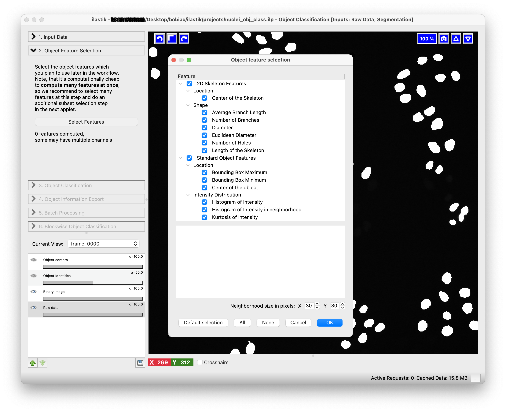
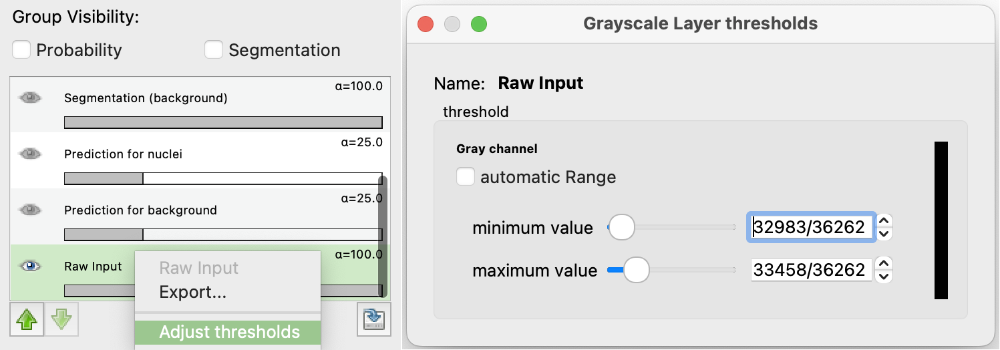
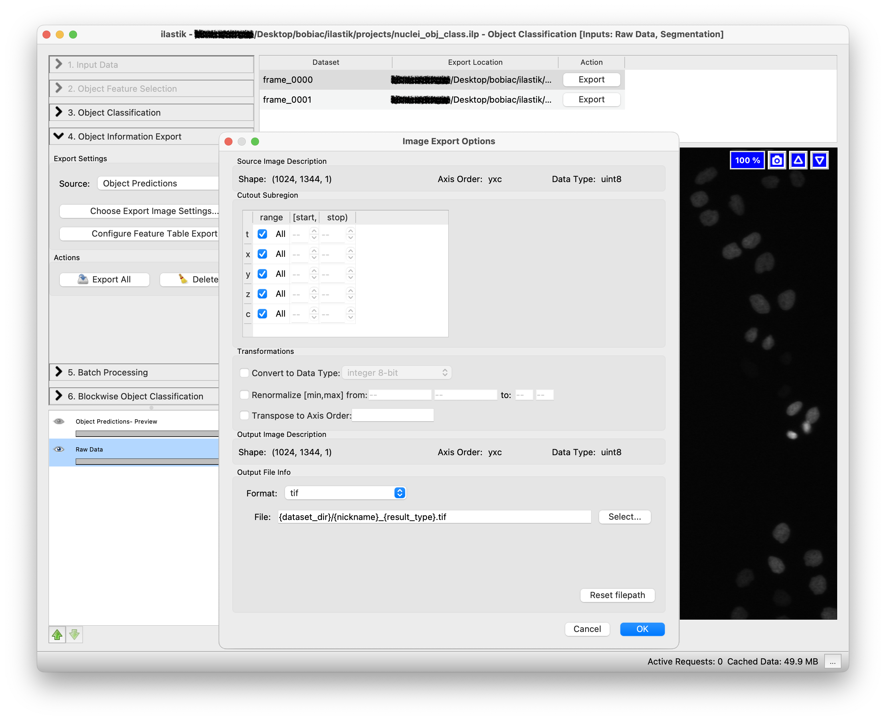
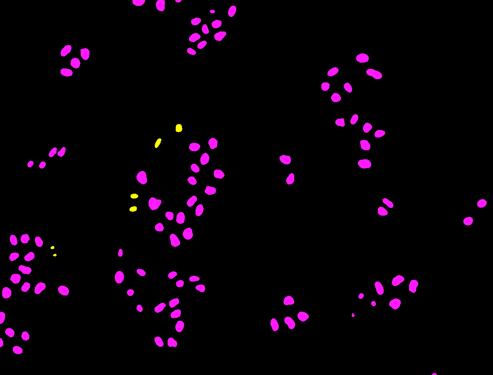
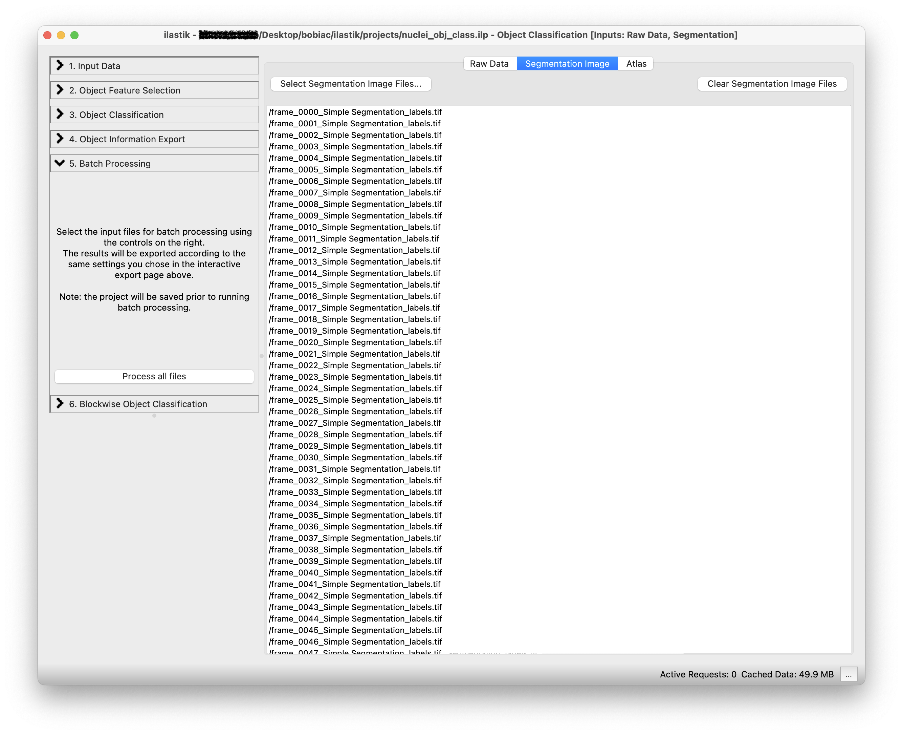

# Ilastik for Object Classification

In this section, we will explore how to use **Ilastik** for [**object classification**](https://www.ilastik.org/documentation/objects/objects). This process is very similar to what we have done in the [**pixel classification**](../05_segmentation/machine_learning/pixel_classification_with_ilastik.md) section and still involves training a machine learning model. However, instead of classifying pixels, we will **classify entire objects** based on **instance segmentation** images.

In this exercise, we will use the **instance segmentation** data from the nuclei dataset that we generated from the [*Form Ilastik Masks to Labels*](../05_segmentation/machine_learning/from_ilastik_masks_to_labels.ipynb) exercise and train a model to separate cells in *mitotic* vs *non-mitotic* states.

    <strong>NOTE:</strong> Ilastik supports a variety of <a href="https://www.ilastik.org/documentation/basics/dataselection#formats" target="_blank">data formats</a>. For simplicity and ease of use during this course, we will use images saved as <strong>.tif</strong> files. However, Ilastik recommends using files saved as <strong>.h5</strong> for [optimal performance](https://www.ilastik.org/documentation/basics/performance_tips). If you wish to use your own dataset and need to convert your files to <strong>.h5</strong>, Ilastik provides tools such as a <a href="https://www.ilastik.org/documentation/fiji_export/plugin" target="_blank">Fiji plugin</a> or a <a href="https://github.com/ilastik/ilastik/tree/main/notebooks/h5convert" target="_blank">Jupyter Notebook</a> with instructions.

## Ilastik Object Classification Workflow

For a detailed workflow instruction, you can refer to the [Ilastik Object Classification Documentation](https://www.ilastik.org/documentation/objects/objects).

### 1. Select the Workflow

When you open **Ilastik**, you will see the [Startup Screen](https://www.ilastik.org/documentation/basics/startup) with various workflows.

There are two options for the **Object Classification** workflow:

- **Start from Pixel Predictions Map**: You can use the *probability maps* that can be generated with the [Pixel Classification](../05_segmentation/machine_learning/pixel_classification_with_ilastik.md) workflow, as Ilastik has a built-in way of converting *probability* map images to instance segmentation images.
- **Start from Segmentation**: You can directly load pre-existing *semantic* or *instance segmentation* images.

For this exercise, we will use the *Instance Segmentation* images that we generated in the previous [Form Ilastik Masks to Labels](../05_segmentation/machine_learning/from_ilastik_masks_to_labels.ipynb) exercise. This also to demonstrate that Ilastik's *object classification* workflow can be used independently, with segmentation results from any source, including Deep Learning approaches that we will explore later in the course.

    <strong>NOTE:</strong> If you want to use semantic segmentation images, make sure that all objects you are considering are clearly separated. With semantic segmentation, touching or overlapping objects cannot be distinguished as individual entities, which can affect the classification accuracy. For better results, especially when dealing with touching objects, it is recommended to use instance segmentation images where each object is already individually labeled and separated.

Select the ***Object Classification [Inputs: Raw Data, Segmentation]*** workflow by clicking on it. You will be automatically brought to the **Input Data** step.

  

    <strong>NOTE:</strong> Remember to save your project regularly using <strong>Cmd+S</strong> (macOS) or <strong>Ctrl+S</strong> (Windows), or via <strong>Project → Save Project</strong>.

### 2. Load the Image Data

The data loading step is similar to the one in the [Pixel Classification](../05_segmentation/machine_learning/pixel_classification_with_ilastik.md) workflow (*Drag and drop* your image files into the ***Add New...*** field). However, in this case, we will need to load not only the *raw data* in the ***Raw Data*** tab but also the *instance segmentation* images in the ***Segmentation Image*** tab. To create a robust classifier, you should load multiple images from the dataset.

It is important that the **order of the images in both tabs matches**, as Ilastik will use the *instance segmentation* images to identify and classify the objects in the corresponding *raw data* images.
By clicking on the ***Summary*** tab, you can verify that the images are correctly paired.

  

### 3. Select the Features

To continue, click on the ***Object Feature Selection*** step (on the left side of the GUI) and then on the ***Select Features*** button. Here, you can select the [object features](https://www.ilastik.org/documentation/objects/objects#from-segmentation-to-object-descriptions---object-feature-selection-applet) that will be used to discriminate between the different objects classes.

    <strong>NOTE:</strong> Once selected, all the features are immediately computed at once for all the images loaded. Therefore, Ilastik suggest to select all features you think will be needed for the training at this step (you will be able to change the selection also in the next step if needed).

  

The goal of this exercise is to classify cells in *mitotic* vs *non-mitotic* states. By looking at the raw images, try to think about which features might be useful for this classification and select them accordingly. For example, you might want to select features related to the *shape*, *intensity*, and *texture*. By hovering over each feature, you can see a brief description of what it measures.

For a detailed feature overview refer to [this documentation](https://www.ilastik.org/documentation/objects/objectfeatures).

### 4. Train the Classifier

The next step is to [train the classifier](https://www.ilastik.org/documentation/pixelclassification/pixelclassification#training-the-classifier). Similartly to the pixel classification workflow, this is an interactive process where you will need to **label a few objects** in the image to provide the classifier with examples of the different classes.

In the ***Training*** step (on the left side of the GUI) you can **add**, **remove** or **edit** the classes (labels) that you want to use for the classification. For this exercise, we will use two classes: ***mitotic*** and ***non-mitotic***. To rename the default classes, *Label 1* and *Label 2*, double-click on each class and type the new name (You can also change the class color by double-clicking on the color box next to the class name).

Now you can start by choosing few objects in the image that correspond to the ***mitotic*** class; select the ***mitotic*** class, select the *Brush* tool (should be the default) and click on one of the segmented nuclei that is in the *mitotic* state.
To **toggled on and off** the visibility of **the segmentation image** and thus visulize the raw data to correctly label the objects, you can press the ***i*** key on your keyboard.
Next repeat the process for the ***non-mitotic*** class, selecting some objects that correspond to the *non-mitotic* state.

    <strong>TIPS:</strong>
    <ul>
        <li>Use <strong>Cmd+Z</strong> (macOS) or <strong>Ctrl+Z</strong> (Windows) to <strong>undo</strong> the last action.</li>
        <li>Use the <strong>Erase</strong> tool to <strong>remove</strong> the annotations.</li>
        <li>To navigate the image viewer, <strong>zoom in and out</strong> using the <strong>mouse wheel</strong> (or trackpad) together <strong>with</strong> the <strong>Cmd (macOS) or Ctrl (Windows) key</strong>, and <strong>pan</strong> the image with the <strong>left mouse button</strong> while holding the <strong>Shift</strong> key.</li>
        <li>To control brightness and contrast, <em>right-click</em> on <strong><em>Raw Input</em></strong> in the <strong><em>Group Visibility</em></strong> section (bottom left) and select <strong><em>Adjust thresholds</em></strong> to set the minimum and maximum display range.</li>
    </ul>
    

        
    

  

To train the classifier and see the predictions, press the ***Live Update*** button. This will update the predictions in real-time as you label more pixels.

The predictions will be displayed as an overlay on the image and colored according to the class colors you defined.

Examine the results for errors and add (or remove) annotations to correct.

Repeat the process of labeling objects (if necessary) and checking the predictions on all the images you loaded (you can switch between images using the ***Current View*** drop-down menu on the left side of the GUI).

Once you are satisfied with the results, you can proceed to the next step of exporting the results and batch processing the images.

### 5. Export the Results

Once the trained model works well with all the training images, you can either [**export the results**](https://www.ilastik.org/documentation/objects/objects#export) for the training images or run the classifier in [**batch mode**](https://www.ilastik.org/documentation/objects/objects#processing-new-images-in-batch-mode) to process many images at once.

Either way, the first step is to select what you want to export by choosing an option in the ***Source*** drop-down menu in the ***Export Settings*** step (on the left side of the GUI). Different options are available but for this exercise, we want to export the **Object Predictions**. This will export new images where each object is assigned a value depending on the class it belongs to. In our case all the objects in the *mitotic* class will be assigned a value of 1, while all the objects in the *non-mitotic* class will be assigned a value of 2 (because class 1 was assigned to *mitotic* and class 2 to *non-mitotic*).

  

The second step is to select how we want to export the results. By clicking on the ***Choose Export Image Settings...*** button, a new window will open where you can select different options including the export format and the output folder where to save the result. Select "tif" as format and leave as default the output file path since it automatically is set to save the results in the same folder as the input images with the suffix appropriately changing depending on the option you select in the ***Source*** drop-down menu (e.g. *_Object Predictions*). Leave the other options untouched since we do not need to change them for this exercise.

  

The third step is to select which features to include in the exported data table. This table will contain detailed measurements and feature values for each classified object. To do so, click on the ***Choose Feature Table Export*** button. A new window will open where you can select where to save the table and which features to include. For this exercise, we will focus on the image outputs, but you can optionally export specific features if you want to explore the quantitative data.

  

Click on the ***Export All*** button to start exporting the object predictions for all the training images. If you look in the folder where your training images are stored, you will find the exported results with the suffix *_Object Predictions.tif*. In the folder where you had the instance segmentation images, you will find the generated table.

  

### 6. Batch Processing

To process many images at once and **run the classifier on all the images in the dataset** you can select the ***Batch Processing*** step (on the left side of the GUI) and simply *Drag and drop* all the files in the dataset folder on the white area of the GUI. Remember to load the *raw data* in the ***Raw Data*** tab and the corresponding *instance segmentation* images in the ***Segmentation Image*** tab (it is important that the **order of the images in both tabs matches**).

  

  

By clicking on the ***Process all files*** button, the classifier will be run on all the images in the dataset and all the nuclei will be classified as *mitotic* or *non-mitotic*.

### 7. What's Next?

The output of this classifier is very similar to the one we obtained in the [Pixel Classification](../05_segmentation/machine_learning/pixel_classification_with_ilastik.md) section, but instead of pixel-wise predictions, we have object-wise predictions. In these images, each nucleus that has been classified as *mitotic* will have a value of 1, while each nucleus that has been classified as *non-mitotic* will have a value of 2. You could use this information to then analyze the cells also based on the cell cycle stage.
