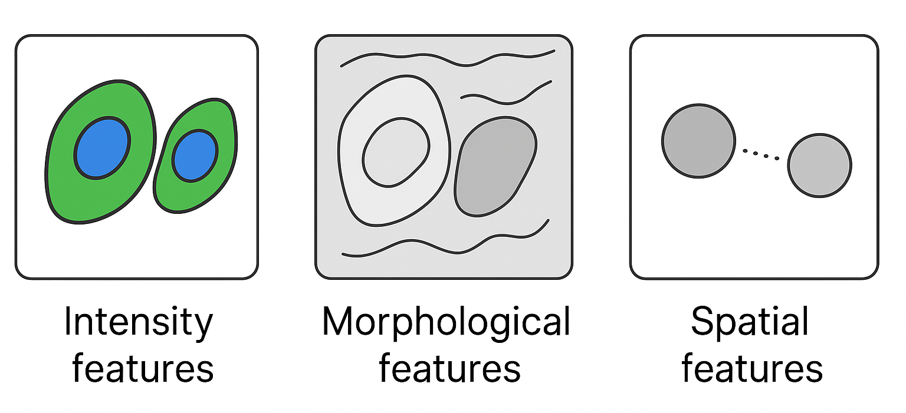

# 07 - <i class="fa-solid fa-chart-simple"></i> Measurement & Quantification using Python

In this section, we will learn how to use Python to measure and quantify data from images, meaning how to go from images to numbers to plots. This process is often referred to as feature extraction. Feature extraction is the process of computing quantitative descriptors from image data that help capture relevant patterns, structures, or biological signals. In the context of microscopy, these features represent properties of cells, tissues, organelles, or other biological structures. Feature extraction bridges raw image data with biological insight, enabling classification, clustering, and statistical analysis.

There are three broad types of features typically extracted:
- Intensity features: Related to the pixel brightness distribution.
- Morphological features: Describe shape and size.
- Spatial features: Capture location and relationship between structures.measurements-illustration.png

    

## Intensity Features

Intensity features summarize the distribution of grayscale or fluorescence values within an object or ROI. These features are sensitive to signal strength and can reflect biological activity like protein expression, DNA content, or mitochondrial potential. Examples are:

- **Mean intensity**: The average pixel intensity within the object.
- **Median intensity**: The middle value in the sorted intensity distribution.
- **Standard deviation**: Measures the spread of intensity values around the mean.
- **Histogram**: Distribution of intensity values.
- **Fluorescence intensity**: Sum of all pixel intensities in the object.
- **Fluorescence intensity ratio**: Ratio of two different channels.

## Morphological Features

Morphological features describe the shape and size of an object. They are computed on segmented regions of interest (ROIs), such as individual nuclei or cells, or even tissues. Examples are:

- **Area**: The number of pixels within the object.
- **Perimeter**: The length of the object's boundary.
- **Circularity**: The ratio of the object's perimeter to the area.

## Spatial Features

Spatial features capture the location and relationship between structures. They are computed on segmented regions of interest (ROIs), such as individual nuclei or cells, or even tissues. Examples are:

- **Centroid**: The center of mass of the object.
- **Distance to nearest neighbor**: The distance to the nearest neighbor object.
- **Convex hull**: The smallest convex polygon that encloses the object.

    <strong>NOTE:</strong> Ensure intensity normalization (e.g., background subtraction, illumination correction) before feature extraction, especially when comparing across fields of view or slides.

## Slides

Eva's slides on microscopy considerations

<a
    class="custom-button custom-download-button" href="../../pdfs/07_measurement_and_quantification/templates.pdf" download> <i class="fas fa-download"></i> Download this Slides
</a>
